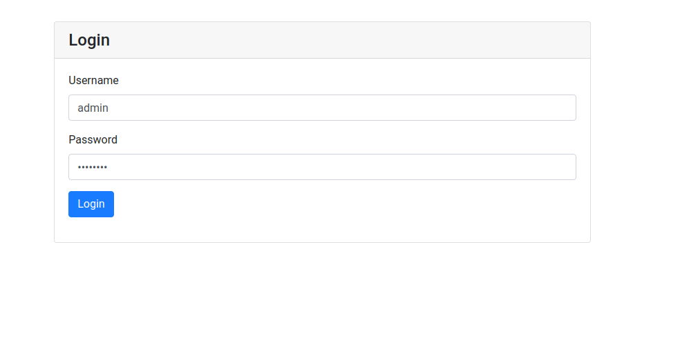
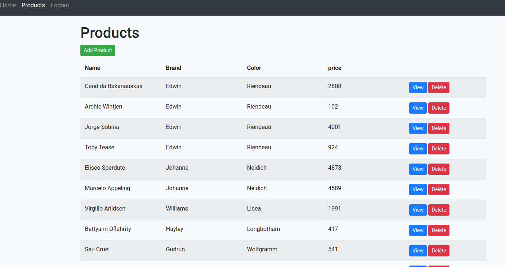

# Front End

Tech Used

1. Angular 10 
2. Basic Bootstrap

### Prerequisite  : Make sure express js is running on port 3000, back end server.

---

## Installation

After cloning run `npm install` to install the dependency and execute `npm start`, your application will be opened on your default browser at `http://localhost:4200`

Login Page

Product List

---

### Requirements Covered

### **Notes**

- [ ]  Provide test coverage.
- [x]  Use state management.
- [x]  Use rxjs operators.
- [ ]  No pages styling is required. Used Bootstrap
- [x]  Login page, the user should be able to login using username and password.
- [x]  logout.
- [x]  Create new products.
- [x]  List products.
- [x]  View product, when the user clicks on one of the rows, the system should display a view product with product details.
- [x]  Delete one or more products.
